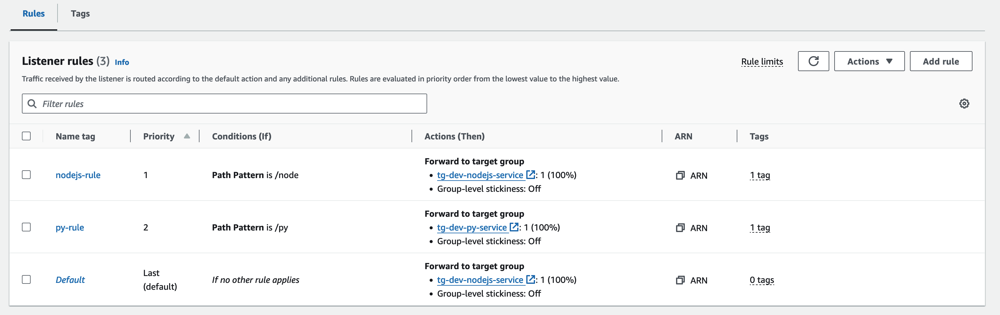
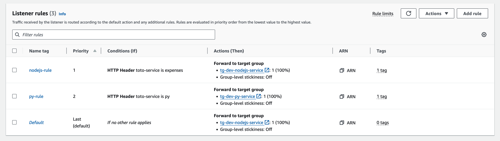

# Using a single ALB for multiple backend ECS Services
This guide covers the scenario where one wants to have a single ALB to expose multiple ECS Services. 

[This guide on using an ALB with ECS](./load-balancer-ecs.md) covers the basics of creating a Load Balancer to publicly expose an ECS Service. That scenario, though, only allows for **one ECS service to be exposesd on the ALB**. 

This guide expands on that to support multiple services behind a single ALB. 

### 1. Intro and key choices
Exposing multiple services on a single ALB requires configuring the Load Balancers' *Listener* to route to different endpoints (ECS Services) based on some condition. 

> Just to remind the AWS architecture for Load Balancers:
>  * Targets are destinations. Each ECS Service needs to be mapped as a target. 
>  * An Application Load Balancer needs to have one or more Listeners configured. 
>  * Each Listener listens to a specific protocol:port. There can be only one listener using a given port. 
>  * A Listener needs to have a default Target Group to which it would route the / base path. 
>  * A Listener can have multiple rules to target a different Target Group based on different conditions. 

Those conditions can be (just citing the most relevant here):
 * **Path-based**: the LB's listener will route based on a path element.  
 *E.g. /expenses goes to the Expenses ECS Service, while /profile goes to the Profile ECS Service.*

 * **Header-based**: the LB's listener will route based on a header.  
 *E.g. if HTTP header 'target-service' is passed with value 'expenses', the route goes to the ECS Expenses Service.*  
 Note that the name of the header can be chosen arbitrarily. 

The choice is important, because in case of **path-based** approach, the LB **does not perform any URL rewrite**, which means that the ECS Service needs to provide all its endpoints under the path that is configured in the Listener's rule. 

### 2. Before anything
Before doing anything you need to setup Target Groups (one for each ECS Service you need to expose on the LB), an ALB and Listener, following [this guide](./load-balancer-ecs.md).

### 3.A. Configuration using the Path-based approach
To use a **path-based** approach, you need to configure the Listener and add multiple rules. 

In the Listener configuration (under ALB configuration), you need to **add a new rule** for each ECS Service you want to expose on the LB. 

In that rule, you need to **add a condition** and select a **path-based** condition.  
Then, specify which path will route to your ECS Service. 

> Important note:  
> The path you choose will have to be reflected in the ECS service. 
> 
> *Example* 
> *If you configure a rule that will target Service A when the caller calls the ALB with path `/serviceA`, then the ECS Service will have to have all its endpoints under `/serviceA`*  
> *If service A has two edpoints `/a` and `/b`, it won't work: its two endpoints need to be rewritten as `/serviceA/a` and `/serviceB/b`*

Once done, you should have something like this in the ALB configuration: 

### 3.B. Configuration using a Header-based approach
The header-based approach is **less invasive** as it does not require any modification of the backend service, but it **requires the caller to pass a specific header** that helps the Listener understand which service it needs to route to. 

To configure the Listener, **add a new rule** for each ECS Service. 

In that rule, specify a **condition** based on a header. 

> *Example:*
> *Configure the rule to have two conditions:*
> * *Condition 1: if HTTP Header 'target-service' is 'expenses' route to ECS Expenses Service*
> * *Condition 1: if HTTP Header 'target-service' is 'profile' route to ECS Profile Service*

Once the configuration is set, you should see something like this (based on the header name you chose): 

### Important: on CORS
In general I've had problems with CORS.  
When creating an ALB Listener, there's always a *default* path.  
That default path is what is used by the preflight requests (OPTIONS) made by a browser, and providing a **fixed** response **does not allow to add HTTP Headers** (like the `Access-Control-Allow-Origin`).  
This means that the OPTIONS pre-flight call always fails. 

*Note that this does not happen in Postman because Postman does not send pre-flight requests, neither does NodeJS request.* The only place where I experience this behaviour is from the browser.

To resolve this I have done the following on the Listener. 
> Under *Attributes* you can *edit* and *Add response headers*. I added the following headers: 
> * `Access-Control-Allow-Origin` (setting it to `*`)
> * `Access-Control-Allow-Headers` (setting it to `*`)
> * `Access-Control-Allow-Methods` (selecting `GET, HEAD, POST, PUT, DELETE, OPTIONS, PATCH`)

That basically makes sure that those headers are **always added** to any HTTP response sent by **any route** of the Listener. 