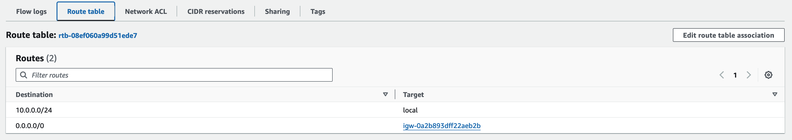

# Making a Subnet Public
To make a Subnet public, you need to **attach an Internet Gateway** to the VPC and update the Subnet routing table to use the IGW. 

Important: When an Internet Gateway is **attached to a VPC**, it allows **bidirectional** internet connectivity. 

To make the Subnet public: 
 * Create an IGW
 * Attach the IGW to the VPC
 * Go in the **route table** of the **subnet** and add a route with a destination of 0.0.0.0/0 for IPv4 traffic or ::/0 for IPv6 traffic, and a target of the internet gateway ID (igw-xxxxxxxxxxxxxxxxx).  
 To do that: 
    * Go on the *subnet*
    * Click on the *route table*
    * Click on *edit routes*
    * Add the route to the IGW

> At this point you should see something like this: 

For more information and references of what documentation I used: 
 * [How Amazon VPC Works - Ip Addressing](https://docs.aws.amazon.com/vpc/latest/userguide/how-it-works.html#vpc-ip-addressing)
 * [Description of an IGW](https://docs.aws.amazon.com/vpc/latest/userguide/VPC_Internet_Gateway.html)
 * [Making a subnet a public subnet by routing to an IGW](https://docs.aws.amazon.com/vpc/latest/userguide/route-table-options.html#route-tables-internet-gateway)
