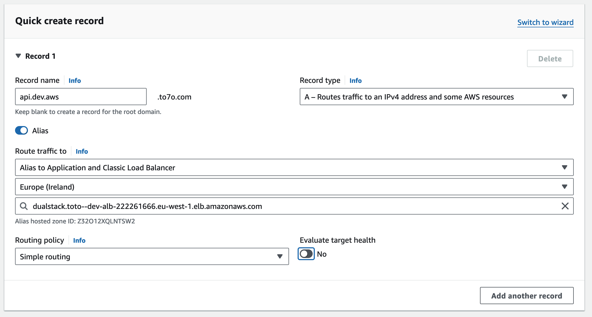

# Using your own Domain name with ALB

It is possible to use your own domain name with an Application Load Balancer. 

Note that this guide only works (afaik) with Domains bought on Route 53. 

## 1. Acquire a domain
If you don't already own a domain, you can buy with **Route 53**. 

## 2. Add a record 
You need to then add an A record to the DNS.  
To do that: 
* Go on Route 53 > `Hosted Zones`.
* Select the Hosted Zone that corresponds to your domain. 
* Create a record specifying: 
    * the **subdomain** to be used
    * flag **Alias**, which will allow you to choose directly the ALB, without specifying any IP Address
    * select the endpoint as Load Balancer, select the region and your Load Balancer.

The creation should look something like this: 

